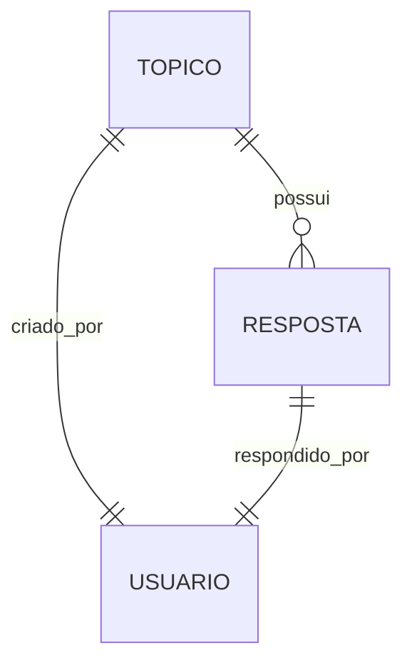

# ForumHub - Challenge Alura Back-End


Projeto desenvolvido como parte do **Challenge Back-End** do programa **Oracle Next Education - Turma G8**, em parceria com a **Alura**.

O objetivo é criar uma API REST de um fórum de discussão, similar ao utilizado pela própria plataforma Alura, permitindo a criação, leitura, atualização e exclusão de tópicos, além de autenticação e segurança com JWT.

---

## 🚀 Funcionalidades da API

- [x] Criar um novo tópico
- [x] Listar todos os tópicos
- [x] Buscar um tópico específico
- [x] Atualizar um tópico
- [x] Deletar um tópico
- [x] Autenticação via JWT
- [x] Validações com Bean Validation
- [x] Migrations com Flyway

---

## 🧠 Descrição técnica

### 🏗️ Arquitetura
O projeto segue os princípios de arquitetura em camadas com uma estrutura modular dividida em:

- `controller` – Camada de entrada da aplicação (REST API)
- `service` – Regras de negócio e orquestração
- `repository` – Persistência e acesso ao banco de dados
- `domain` – Modelos da aplicação
- `dto` – Objetos de transferência de dados (entrada e saída)
- `config` – Configurações gerais (segurança, CORS etc.)

---

## ⚙️ Tecnologias e bibliotecas

| Categoria               | Tecnologia / Biblioteca                  |
|------------------------|------------------------------------------|
| Linguagem              | Java 21                                  |
| Framework principal    | Spring Boot 3.5.3                         |
| ORM                    | Spring Data JPA                          |
| Banco de dados         | MySQL                                    |
| Migrations             | Flyway                                   |
| Segurança              | Spring Security + JWT (Auth0)            |
| Validações             | Bean Validation                          |
| Testes                 | JUnit, Spring Boot Test, Spring Security Test |
| Build tool             | Maven                                    |
| Outras                 | Lombok, DevTools                         |

---

## 🛡️ Autenticação e Segurança

O projeto implementa segurança baseada em **JWT** para proteger rotas sensíveis. A autenticação é feita via email e senha, e um token JWT é retornado ao usuário autenticado, que deverá enviá-lo no header `Authorization` em requisições protegidas.

---

## 🔁 Migrations com Flyway

As versões do banco de dados são gerenciadas com o **Flyway**, garantindo controle de versão sobre as estruturas e mantendo consistência nos ambientes. Todas as alterações no schema estão na pasta `src/main/resources/db/migration`.

---

## 🧪 Testes

O projeto utiliza `JUnit 5` e `Spring Boot Test` para garantir o bom funcionamento das rotas e da lógica de negócio. As classes de teste se encontram em `src/test/java`.

---

## 🖼️ Diagrama do Banco de Dados



> Baseado no modelo fornecido pelo desafio. A implementação final pode conter adaptações.

---

## 📁 Estrutura do Projeto

```
src
├── main
│   ├── java/com/forumhub
│   │   ├── config
│   │   ├── controller
│   │   ├── domain
│   │   ├── dto
│   │   ├── repository
│   │   └── service
│   └── resources
│       ├── db/migration
│       └── application.properties
└── test
    └── java/com/forumhub
```

---

## 📦 Como executar

> Pré-requisitos: Java 21, Maven, MySQL rodando na porta padrão (3306)

1. Clone o repositório

```bash
git clone https://github.com/eliezermoraesss/forumhub-challenge-alura.git
cd forumhub-challenge-alura
```

2. Configure o banco de dados no `application.properties`

```properties
spring.datasource.url=jdbc:mysql://localhost:3306/forumhub
spring.datasource.username=seu_usuario
spring.datasource.password=sua_senha
```

3. Execute o projeto

```bash
./mvnw spring-boot:run
```

4. Acesse a API:

```
http://localhost:8080
```

---

## 🔐 Endpoints protegidos

As rotas de tópicos são públicas para `GET`. As rotas de `POST`, `PUT`, `DELETE` exigem autenticação via JWT.

Exemplo de uso do token:

```
Authorization: Bearer <seu_token_jwt>
```

---

## 📌 Desafio original

Este projeto foi baseado no [Challenge Back-End da Alura](https://www.alura.com.br/challenges/back-end). A proposta era construir uma API REST que simula um fórum educacional, focando em boas práticas de desenvolvimento com Java e Spring Boot.

---

## ✍️ Autor

Desenvolvido com 💙 por [Eliezer Moraes](https://github.com/eliezermoraesss)

---

## 📄 Licença

Este projeto está licenciado sob a licença MIT. Veja o arquivo `LICENSE` para mais detalhes.
